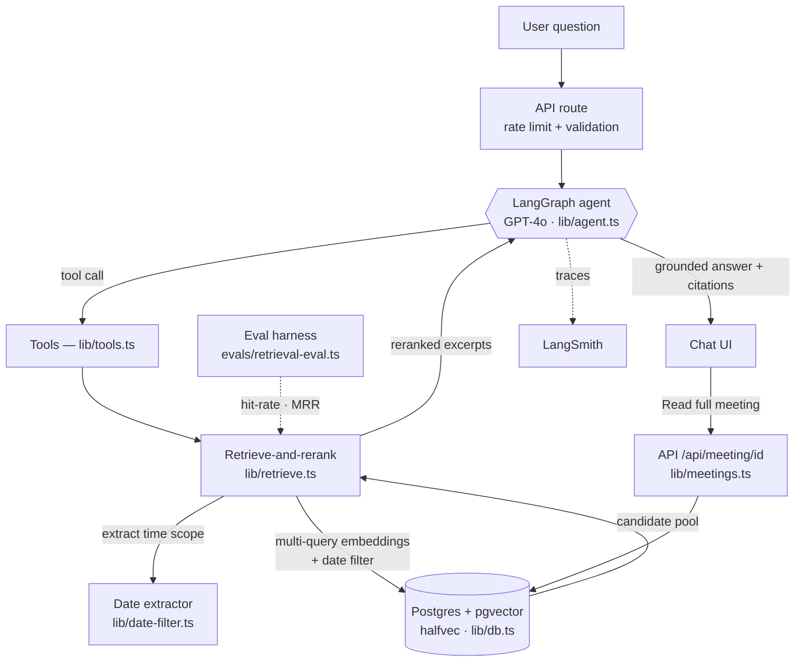

# Fed Minutes Chat

A conversational AI interface for exploring Federal Reserve meeting minutes from 1967–1973. Ask natural language questions about monetary policy, economic conditions, and Fed decision-making during one of the most pivotal eras in modern economic history — covering the collapse of Bretton Woods, the Nixon Shock, rising inflation, and the shift from fixed to floating exchange rates.

Unlike traditional keyword search, this app uses **semantic search** (vector embeddings) to find relevant passages by meaning. Rather than a single fixed lookup, a **GPT-4o tool-calling agent** plans its own retrieval — issuing multiple searches, narrowing by time period, and drilling into specific meetings — before synthesizing a cited answer.

## How It Works

The chat endpoint runs an agentic research loop instead of a one-shot retrieve-then-answer pass:

1. **User asks a question** in natural language
2. **The agent plans its retrieval.** A GPT-4o agent built on **LangGraph** is given two tools and decides how to use them:
   - `search_minutes` — date-aware hybrid retrieval (multi-query expansion + LLM reranking) across all minutes
   - `search_within_meeting` — semantic search scoped to a single meeting, for drilling into the most relevant one
3. **The loop runs** (`lib/agent.ts`): a LangGraph state machine cycles between the model and the tools — the model can search repeatedly, comparing topics or narrowing in, reading each result before deciding its next step. A search is forced on the first turn so every answer is grounded in retrieved text.
4. **GPT-4o synthesizes** an answer grounded only in the excerpts the agent retrieved.
5. **Citations** are deduped across all of the agent's searches, ranked by relevance, and displayed with meeting dates, attendees, relevance scores, expandable excerpts, and a **"Read full meeting"** reader that reconstructs the complete minutes from the database.

Each `search_minutes` call runs **retrieve-and-rerank with date-aware filtering**: the question's temporal scope (e.g. "August 1971") is extracted into a SQL date range, multi-query expansion broadens recall, a `meeting_date` filter sharpens precision on time-scoped questions, and LLM reranking does the final ordering — with a fallback to unfiltered retrieval if a date constraint is too narrow.

## Architecture



The LangGraph agent is the core: GPT-4o decides *when* and *how* to retrieve, calling the tools repeatedly until it has enough grounded evidence to answer. Each `search_minutes` call runs **retrieve-and-rerank with date-aware filtering** — multi-query expansion for recall, a SQL `meeting_date` filter for time-scoped precision, then LLM reranking for final ordering. The vector store is **Postgres + pgvector** (Pinecone is also supported via a `VECTOR_BACKEND` flag), which is what makes the date filter possible — a real `date` column ranges cleanly where a vector store's metadata strings can't. The eval harness exercises the same retrieval path independently of generation, and runs are traced to LangSmith when enabled.

## Tech Stack

- **Frontend:** Next.js 14 (App Router), React 18, TypeScript, Tailwind CSS
- **Agent orchestration:** LangGraph (stateful GPT-4o tool-calling loop)
- **Retrieval:** date-aware hybrid — multi-query expansion + LLM reranking (LangChain) + a SQL date filter for time-scoped questions
- **Embeddings:** OpenAI text-embedding-ada-002 (1536 dimensions)
- **Vector store:** Postgres + pgvector (Supabase) — `halfvec` with exact cosine search; Pinecone also supported via the `VECTOR_BACKEND` flag
- **Observability:** LangSmith tracing (optional, env-gated)
- **Deployment:** Vercel

## Data Pipeline

The ingestion pipeline (`scripts/ingest.ts`) processes meeting data through:

1. **Chunking** — splits meeting text on sentence boundaries using tiktoken (500-token chunks, 50-token overlap)
2. **Embedding** — generates vector embeddings via OpenAI in batches of 100
3. **Upserting** — stores chunks with metadata (date, attendees, topics) in the configured backend

The vector store is selected by `VECTOR_BACKEND` (`postgres` or `pinecone`):

```bash
npm run fetch-data        # Download meeting data

# Postgres + pgvector (production default)
npm run setup-postgres    # Create the pgvector schema (halfvec + indexes)
npm run ingest:postgres   # Embed + load into Postgres

# Pinecone (alternative)
npm run setup-pinecone    # Create the Pinecone index
npm run ingest            # Embed + load into Pinecone

npm run ingest:dry-run    # Test the pipeline without API calls
```

## Getting Started

```bash
# Install dependencies
npm install

# Set up environment variables
cp .env.example .env
# Add OPENAI_API_KEY, plus either DATABASE_URL (Postgres) or PINECONE_API_KEY,
# and set VECTOR_BACKEND accordingly

# Run the data pipeline (if starting fresh) — Postgres backend
npm run fetch-data
npm run setup-postgres
npm run ingest:postgres

# Start the dev server
npm run dev
```

Open [http://localhost:3000](http://localhost:3000) to start asking questions.

## Testing

```bash
npm test              # Run all tests
npm run test:watch    # Run tests in watch mode
```

36 tests across 6 suites:
- **Agent loop** — forced grounding on the first turn, multi-step tool calls, meeting drill-down, tool-turn-budget fallback, and tool-failure recovery (the chat model and retrieval are mocked; the real LangGraph state machine runs)
- **Date extractor** — temporal-constraint extraction and null-handling (model mocked)
- **Retrieval hybrid** — date-filter application, filtered-with-fallback, and backend gating
- **Meeting reader** — chunk-overlap stitching into clean prose
- **Rate limiter** — request allowance, IP isolation, window reset, remaining count
- **Text chunker** — sentence boundary splitting, token limits, overlap, content preservation

## Evaluation

Retrieval quality is measured independently of generation with an eval harness (`evals/retrieval-eval.ts`). It runs a golden set of questions and, for each, scores whether the passages a correct answer depends on are surfaced — comparing three strategies **side by side**: plain single-query, single-query + date filter, and full retrieve-and-rerank (the production path). Requires `OPENAI_API_KEY` and the configured backend (`DATABASE_URL` for Postgres, where the date filter is active).

```bash
npm run eval                    # default top-k 5
npm run eval -- --top-k 10      # widen retrieval
npm run eval -- --threshold 0.8 # gate strictness
```

Each case in `evals/dataset.json` declares what a correct retrieval should surface:
- **`expected_keywords`** — substrings that should appear in the retrieved excerpts
- **`expected_meetings`** — meeting IDs that should appear in the ranked results

The harness reports **keyword recall**, **meeting hit-rate**, and **MRR** for each strategy, and exits non-zero when keyword recall falls below the threshold (so it can gate CI).

This harness drove the retrieval design. At top-k=5, single-query search **misses** the canonical Nixon Shock meeting (`NT50808.txt`) for a "convertibility"-phrased question — the corpus has many meetings discussing gold convertibility, and the discriminating signal ("August 1971") is temporal, which embeddings capture poorly. Multi-query expansion alone didn't fix it (the eval proved that). Two layers did, and they compose: a **date filter** scopes to the relevant period, and **LLM reranking** promotes the actual announcement to the top. Measured on the labeled cases:

| Strategy | meeting hit-rate | MRR |
|---|---|---|
| single-query | 33% | 0.33 |
| + date filter | 67% | 0.50 |
| retrieve-and-rerank | **100%** | **1.00** |

The date filter helps in proportion to how tightly it scopes (a month recovers the case; a whole year is still too broad — rerank catches the rest). The dataset is a seed set meant to be expanded; the companion [FedMinutes](https://github.com/murguia/FedMinutes) project is well suited to generating verified question → meeting labels.

### Answer quality (faithfulness)

Good retrieval is necessary but not sufficient — the generated answer also has to stay grounded. `evals/answer-eval.ts` runs the **full agent** on the golden questions and uses an LLM judge (gpt-4o) to score each answer for **faithfulness** (is every claim supported by the retrieved excerpts?) and **relevance** (does it answer the question?), gating on mean faithfulness.

```bash
VECTOR_BACKEND=postgres npm run eval:answers
```

On the current golden set the agent scores **5.0 / 5.0 faithfulness** with zero unsupported claims — its forced-search grounding holds. Two honest caveats: the judge is itself an LLM (a signal, not ground truth), and a perfect score partly reflects a small, curated set — so this is best read as a **regression guardrail** that would catch hallucination introduced by a future model or prompt change, not a proof of perfection. (Building it was itself a lesson: an early version truncated the excerpts shown to the judge and reported a false 2.4/5 — the eval was wrong, not the agent.)

## Companion Project

This project is the consumer-facing counterpart to [FedMinutes](https://github.com/murguia/FedMinutes), a Python research backend with Jupyter notebooks for deep analysis and report generation.

| Aspect | FedMinutes | fedmin-chat |
|--------|-----------|-------------|
| Type | Python backend + Jupyter notebooks | Next.js web app |
| Interface | Notebooks for researchers | Chat UI for end users |
| Embeddings | all-MiniLM-L6-v2 (local, 384d) | OpenAI ada-002 (API, 1536d) |
| Vector DB | ChromaDB (local) | Postgres + pgvector (Supabase) |
| Output | Academic reports (HTML/PDF) | Conversational responses with citations |
| Deployment | Local/research use | Vercel |

## Data Attribution

The documents in this project are **Federal Reserve Board of Governors meeting minutes** — distinct from the more commonly known FOMC transcripts. While FOMC transcripts are released after 5 years, Board of Governors minutes had never been publicly released; the most recent public ones dated to December 1966 before this FOIA request.

These approximately 30,000 pages were obtained via a Freedom of Information Act (FOIA) request by [Crisis Notes / Nathan Tankus](https://www.crisesnotes.com/database/), spanning 1967–1973 and covering over 1,100 meetings. The documents reveal previously unknown institutional decisions, including how the Fed nearly repealed its own emergency lending powers in 1967 and came close to bailing out the savings and loan industry in 1973.

Read more: [Here Are The 30,000 Pages of Federal Reserve Board Meeting Minutes I Got Through FOIA](https://www.crisesnotes.com/here-are-the-30-000-pages-of-federal-reserve-board-meeting-minutes-i-got-through-foia/)
